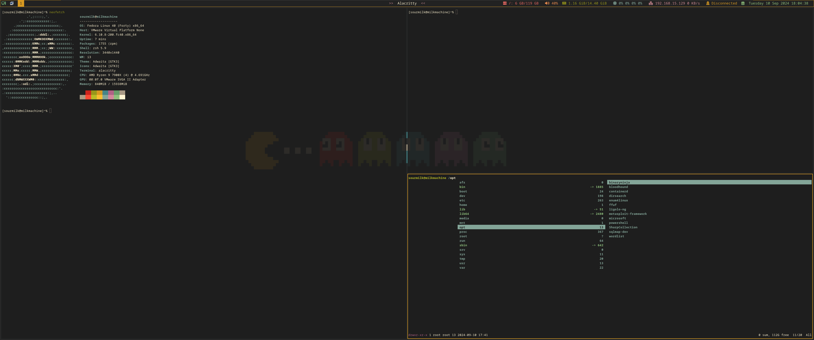
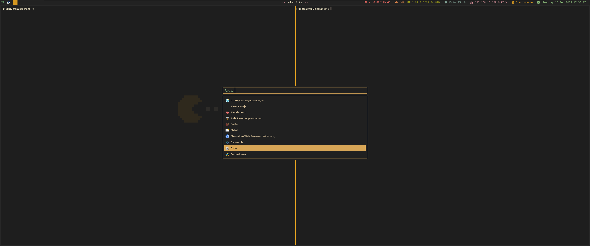

# Fedora Attack Box
This Ansible playbook is designed to setup my Fedora-based environment, installing all my preferred pentesting and red team tools. Additionally, it configures my i3 desktop, making the setup process for new VMs quick and efficient without unnecessary extras found in distributions like Kali or Parrot..... Plus, i3 is just mo betta!




## Usage
To run the playbook and install the tools:

1. Review `main.yml` and comment out (`#`) any lines corresponding to tools you do not want to install.
2. Run the following command to execute the playbook:
```bash
   ansible-playbook -i localhost, --connection=local main.yml --ask-become-pass
```
3. Restart your system after the playbook completes.

## Tools Included
### Scanner Tools
```
Nmap
Masscan
ffuf
dirsearch
feroxbuster
sqlmap
```

### Active Directory Tools
```
NetExec
enum4linux
Bloodhound CE
impacket
```

### Password Recovery Tools
```
John
hashcat
```

### Miscellaneous
```
MetaSploit
SharpCollection
Chisel
ligolo-ng
evil-winrm
wordlists
Seclists
BinaryNinja
```

### Terminals
```
alacritty
Guake
PowerShell
Terminator
```

### Utilities
```
Docker
FlameShot
FTP
Ranger
ROFI
PolyBar
FontAwesome-6
zsh (autosuggestions syntax-highlighting)
nitrogen
openvpn
chromium
picom
```

### TODO
```
burp
```