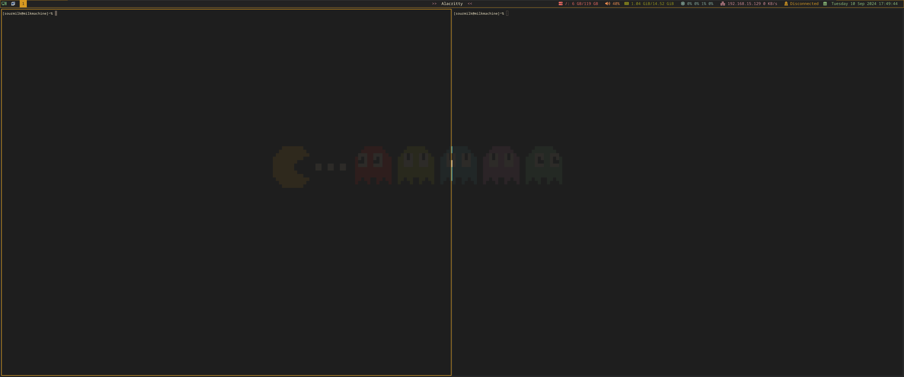

# Fedora Attack Box
This Ansible playbook is designed to set up a Fedora-based environment with a selection of my favorite tools specifically for CTF challenges, red teaming, and pentesting. This was created to make my life easier with new VM installs without the extra tools I never touch in distros Kali or Parrot.



## Usage
To run the playbook and install the tools:

1. Review `main.yml` and comment out (`#`) any lines corresponding to tools you do not want to install.
2. Run the following command to execute the playbook:
```bash
   ansible-playbook -i localhost, --connection=local main.yml --ask-become-pass
```
3. Restart your system after the playbook completes.

## Tools Included
### Scanner Tools
```
Nmap
Masscan
ffuf
dirsearch
feroxbuster
sqlmap
```

### Active Directory Tools
```
NetExec
enum4linux
Bloodhound CE
```

### Password Recovery Tools
```
John
hashcat
```

### Miscellaneous
```
MetaSploit
SharpCollection
Chisel
ligolo-ng
evil-winrm
wordlists
Seclists
BinaryNinja
```

### Terminals
```
alacritty
Guake
PowerShell
Terminator
```

### Utilities
```
Docker
FlameShot
FTP
Ranger
ROFI
PolyBar
FontAwesome-6
zsh (autosuggestions syntax-highlighting)
nitrogen
openvpn
chromium
picom
```

### TODO
```
burp
impacket-scripts (pipx this will need work)
```